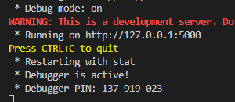
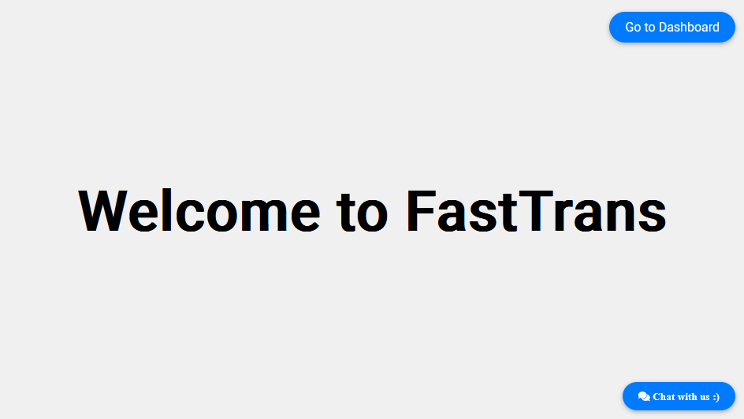
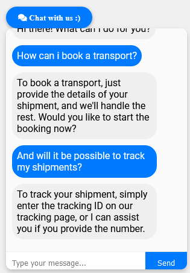
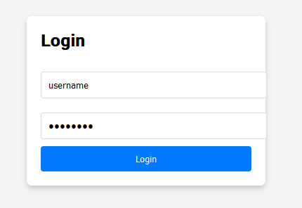
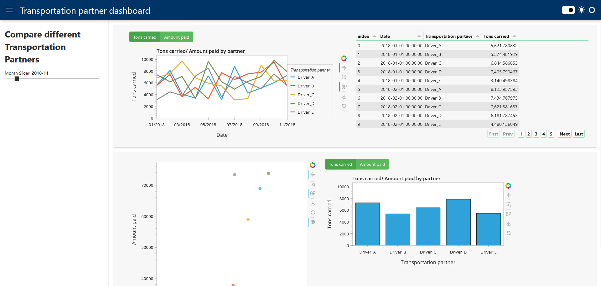

# Website with Chatbot and Interactive Visualisation Dashboard

This project is about a fictional companies' website which includes a chatbot and an integrated interactive dashboard. The dashboard page is protected with a requiered login and password. The websites foundation is a flask application. The chatbot is built upon a neural network. NLTK for text processing and Tensorflow for Machine Learning constitute together the foundation of this chatbot.
For your own personal chatbot simply adjust intents file. Modern company website nowadays have simple chatbot for giving information and helping the sites visitors. The integrated dashboard page should be only for staff, therefore it is protected with a password login. 

The project consists of the following files:

1. The script _model_training.py_ builds and trains a neural network for text classification based on the _intents.json_ file. NLTK prepares the input (text cleaning, tokenizing, lemmatizing) for the neural network. Tensorflow then processes the prepared input through a trained model for predicting the meaning of an user input.

2. _intents.json_: This file trains the model with some possible text intents which consequently create a certain response. In order to adapt it to your own needs, adjust every "tag" with basically the header of the section, the "patterns" with some possible input and in "responses" you define the desired output for this topic.

3. _app.py_: This is the main file which executes the flask web application and simultanesouly a Panel server which runs the dashboard in a seperate thread. Flask run on port 5000 and Panel on port 5006.

4. _utils.py_: This file contains functions which work together to process user input, classify its intent and return an appropriate response. The are used in the _app.py_ file.

5. Templates: _index.htm_ _dashboard.htm_ _login.htm_: These three files are the ones which the _app.py_ is pointing to. _index.htm_ serves here as the main page.

6. Static: _jquery-3.7.1.min.js_: To run this app locally without relying on internet connection this file is included into _index.htm_.

7. model: _chatbot_model.keras_ _classes.pkl_ _words.pkl_ _intents.json_: _chatbot_model.keras_ contains the trained neural network model with its structure, weights and parameters after the training. _classes.pkl_ contains a list of unique intent tags (classes) which are possible outputs (categories) the chatbot predicts during classification. _words.pkl_ has the processed vocabulary (lemmatized and filtered words).

8. _synthetic_data.csv_: This is a synthetically created data file with data about five drivers and the amount in tons they carried over five years plus the amount of money the were paid. This data serves in the dashboard for some visual analysis. The data processing is still quite developable since it has continous strong sparks which makes it hard to recognize certain trends. An potential approach in solving this could be creating a moving average. 

## Getting started

To set up this repo create a folder for the project on your system (instructions for windows), open a terminal window, write "cd" and paste the folder path cd "C:\Users\user\path\to\your\folder". Then type `git clone https://github.com/Yesitin/Website-with-Chatbot-and-Interactive-Dashboard.git` to download the whole repository (ensure that you have installed python and git).

Next, create a virtual environment in order to avoid dependency conflicts. For this, type into the terminal python -m venv env. With `env\Scripts\activate` you start the environment.

Now you can install all dependencies with `pip install -r requirements.txt`. 

After the project is set up, you need build a model for the chatbot. To adapt the chatbot to your needs change the intents file with your desired responses from the chatbot. Then, simply run the script _model_training.py_.

Finally, run the main file _app.py_ to start the flask server and the panel dashboard. Click in your terminal on the output `http://127.0.0.1:5000` or enter it in your browser URL search bar. When the server is successfully running, note that if you click on Dashboard you will be asked for username und password. Both of them are defined in the _app.py_ file.

## Use example

After running the _app.py_ file you will see this. Press Control and click on `http://127.0.0.1:5000`

The front page looks like this (the text can be changed in index.htm):

Chatbot: 

Login:

Dashboard:

